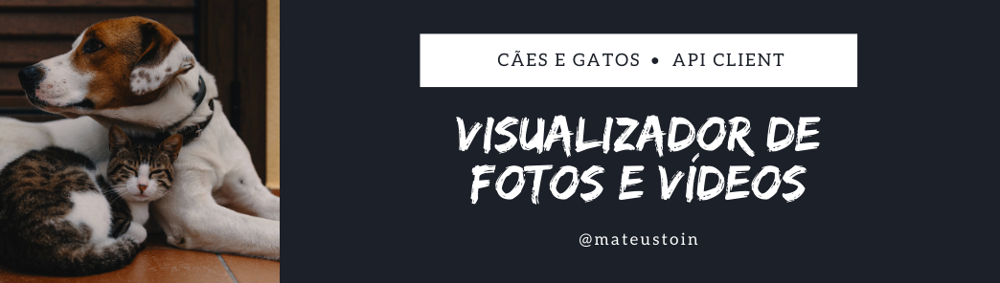
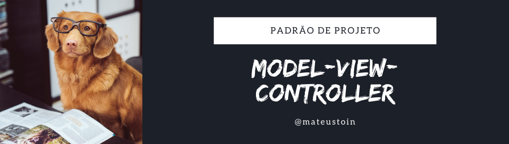
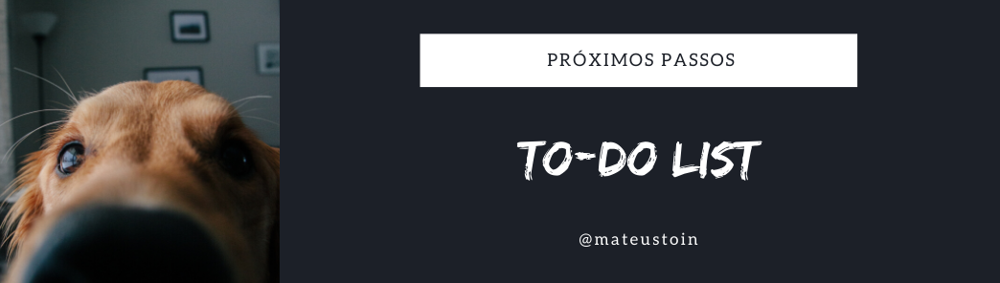
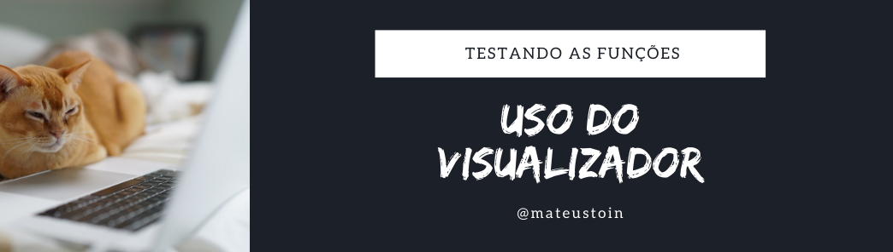

<!--- # Requisição de CEP, Rua, Cidade e Estados --->

<p>
    API Client criado para visualizar fotos e vídeos de <b>doguinhos e gatinhos</b>. O objetivo é praticar diversos conceitos da linguagem e padrões de projeto, além de descontrair com imagens e vídeos engraçados durante a quarentena. O padrão de projeto escolhido para o desenvolvimento é o <b>MVC (Model-View-Controller)</b>, implementado em <b>Python</b>.
</p>

<p>
    As API's utilizadas neste projeto foram a <a href="https://random.dog/">random.dog/</a> e <a href="https://aws.random.cat/">aws.random.cat/</a>, que disponibilizam acesso gratuito e sem registro. Nessas API's é possível realizar requisições que retornam links de vídeos e fotos de gatos e cachorros aleatórios. Na maioria das vezes são imagens engraçadas e divertidas de assistir, por isso é perfeito para o objetivo desse projeto. Os links são processados e as imagens e vídeos baixados para que os resultados sejam visualizados na tela. Diversas funcionalidades como utilização do teclado são utilizados para passar as imagens e oferecer uma experiência mais fácil. <i>A velocidade em que as imagens aparecem dependem diretamente da velocidade da internet do usuário</i>.
</p>

---

# Sumário
1. [Introdução](#introducao) 
1. [Instalando pacotes](#instalacao)
2. [Padrão Model-View-Controller](#mvc)
    - [AnimalModel](#animalmodel)
    - [AnimalView](#animalview)
    - [AnimalController](#animalcontroller)
3. [To-Do List da Aplicação](#todo-list)
4. [Uso do API Client](#usage)
    - [Visualização de fotos](#fotos-animais)
    - [Visualização de vídeos](#videos-animais)

---

# Instalando pacotes <a id="instalacao"></a>

Para instalar os pacotes utilizados no projeto, basta ter o <i>pip</i> instalado e utilizar o comando a seguir:

`pip install -r requirements.txt`

- *requests* é utilizado para realizar todas as requisições à API's citadas na introdução
- *numpy* é utilizado para fazer as transformações da imagem em array, para que todas as informações dos pixels (RGB) sejam armazenadas de uma forma que o opencv consiga ler
- *open_cv* carrega as imagens e vídeos para visualização na tela. 

---



## AnimalModel <a id="animalmodel"></a>

<p>
    A implementação do <i>AnimalModel</i> consiste em realizar as requisições para as API's e tratar dados como tipo de arquivo, se é imagem, vídeo, gif. Cada classe (Cachorro e Gato) possui suas próprias requisições, a fim de resolver as particularidades de cada tipo de dado que é retornado. Além disso, lança <i>exceções</i> para diversos problemas que podem ocorrer no processo, seja pelo usuário ou pela API.
</p>

## AnimalView <a id="animalview"></a>
 
<p>
    A implementação do <i>AnimalView</i> consiste apenas em organizar a visualização dos dados retornados pelo <i>AnimalModel</i>. A visualização deve ser feita de forma clara para o usuário, a fim de oferecer uma experiência boa para quem utiliza. Atualmente toda a visualização é feita utilizando o <i>Opencv</i>, utilizando a janela padrão de visualização. Com a classe de visualização separada o projeto se torna mais modularizado, com responsabilidades independentes, tornando mais fácil futuras manutenções e melhorias. 
</p>

## AnimalController <a id="animalcontroller"></a>

<p>
    A implementação do <i>AnimalControl</i> é feita para que o usuário tenha acesso aos métodos para o uso da API como um cliente. Estes métodos coletam os dados necessários do usuário, invoca o <i>model</i> para tratá-los e organizar os dados, depois utiliza esses resultados para invocar o <i>view</i> e exibir os dados para o usuário. Essa orquestração é feita apenas pelo <i>controller</i>, ao qual o usuário tem contato. Nele também são feitos os tratamentos de exceção, simplificando ainda mais o retorno para o usuário verificar e realizar ações a respeito.
</p>

---



<p>
    Aqui serão apresentadas as próximas ideias a serem implementadas para que o projeto tenha cada vez mais funcionalidades.
</p>

- [x] Visualiza fotos de doguinhos
- [x] Visualiza vídeos de doguinhos
- [ ] Visualiza fotos e vídeos de doguinhos
- [ ] Ajuste de dimensão
    - [ ] Fotos
    - [ ] Videos
<!--- [ ] Visualizar fotos de gatinhos
- [ ] Visualizar vídeos de gatinhos-->
- [x] Visualizar fotos de raposinhas
- [ ] Salvar fotos e vídeos que gostou

---



> Versão do Python utilizada: Python 3.7.6

## 1. Visualizando apenas fotos <a id="fotos-animais"></a>

> main.py

```python
python main.py

> Escolha opção de fotos

Pressione letra 'ESC' para fechar a visualização
Pressione qualquer outra tecla para ver mais fotos
```

<p align='center'>
&nbsp;&nbsp;
</p>    

## 2. Visualizando apenas vídeos <a id="videos-animais"></a>

> main.py

```python
python main.py

> Escolha opção de fotos

Pressione letra 'q' para fechar a visualização
Pressione qualquer outra tecla para ver mais vídeos
```

<p align='center'>
&nbsp;&nbsp;
</p>    